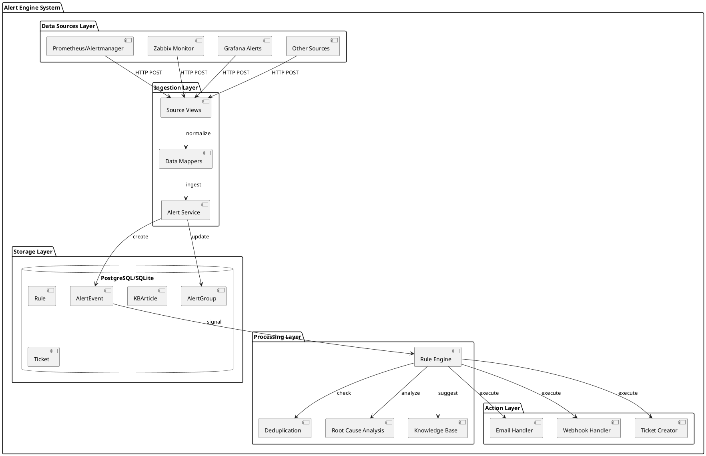
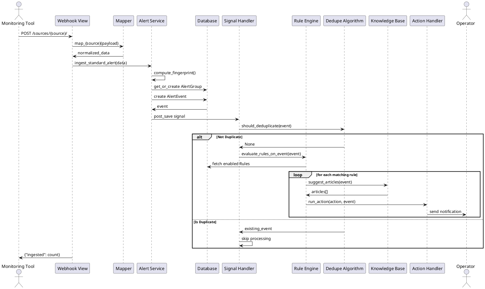
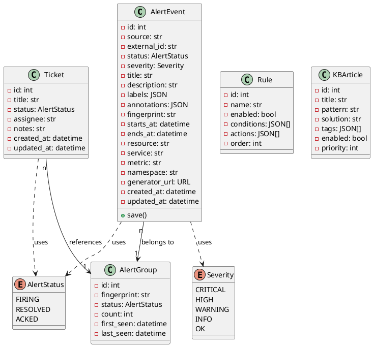
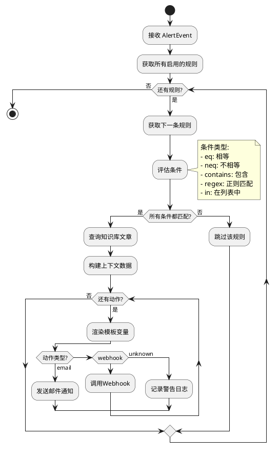

# Alert Engine 架构分析报告

## 一、功能对比分析

根据代码审查，alert-engine 系统功能与图片中展示的数据处理引擎架构基本一致，以下是详细对比：

### ✅ 已实现的核心功能

| 图片功能模块 | 代码实现情况 | 实现位置 |
|------------|------------|---------|
| **监控工具集成** | ✅ 已实现 | `sources/` 模块 |
| - Zabbix | ✅ 支持 | `sources/mappers.py:map_zabbix()` |
| - Prometheus (Alertmanager) | ✅ 支持 | `sources/mappers.py:map_alertmanager()` |
| - Grafana | ✅ 支持 | `sources/mappers.py:map_grafana()` |
| - 华为云等 | ⚠️ 可扩展 | 通过添加新的 mapper 实现 |
| **数据标准化** | ✅ 已实现 | `sources/mappers.py` |
| **规则引擎** | ✅ 已实现 | `rules/engine.py` |
| **告警汇聚** | ✅ 已实现 | `alerts/services.py` (AlertGroup) |
| **智能算法** | ⚠️ 部分实现 | `algorithms/` 模块 |
| - 去重 | ✅ 已实现 | `algorithms/dedupe.py` |
| - 根因定位 | ⚠️ 基础实现 | `algorithms/rca.py` (简单实现) |
| **知识库** | ✅ 已实现 | `knowledge/` 模块 |
| **协作流转** | ✅ 已实现 | `workflows/` + `actions/` |
| **通知必达** | ✅ 已实现 | `actions/handlers.py` |

### ⚠️ 差异和待改进项

1. **根因定位算法**: 当前实现较为简单，仅基于 service/namespace 标签
2. **解决方案推荐**: 知识库匹配基于正则，可考虑引入 AI/ML
3. **问题处理流程**: Ticket 系统基础，缺少完整的工单流转状态机

## 二、代码质量评估

### 优点
1. **模块化设计清晰**: 各功能模块职责分明
2. **Django 最佳实践**: 使用了信号、事务、ORM 等特性
3. **扩展性良好**: 新数据源和动作类型易于添加
4. **数据一致性**: 使用事务和锁保证数据完整性

### 改进建议
1. **异步处理**: 规则评估可改为异步，提高吞吐量
2. **缓存机制**: 添加 Redis 缓存热点数据
3. **监控指标**: 添加 Prometheus metrics 暴露系统指标
4. **错误处理**: 加强异常处理和重试机制
5. **测试覆盖**: 需要添加单元测试和集成测试

## 三、系统架构UML图

### 3.1 组件图

### 3.2 序列图 - 告警处理流程

### 3.3 类图 - 核心模型

### 3.4 活动图 - 规则引擎处理流程

## 四、流程验证脚本

创建一个端到端的验证脚本来测试整个流程：
